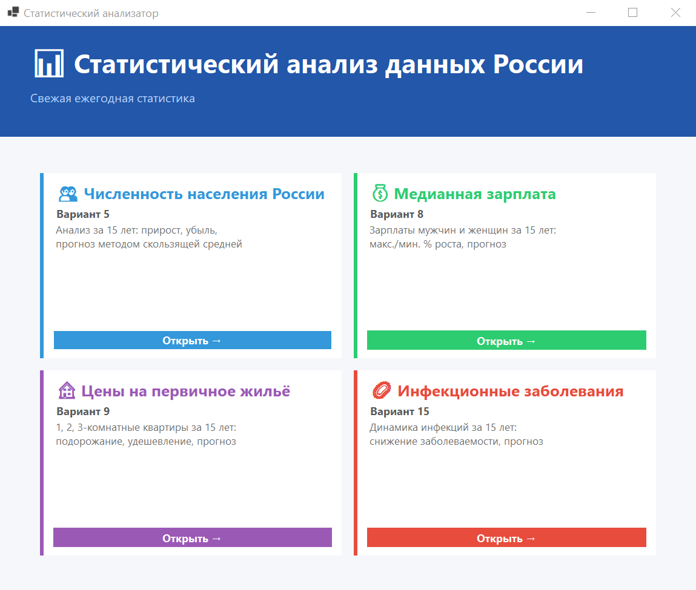
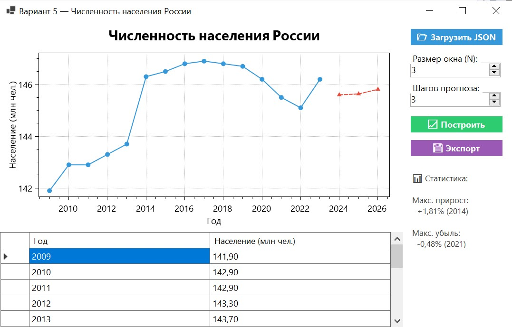
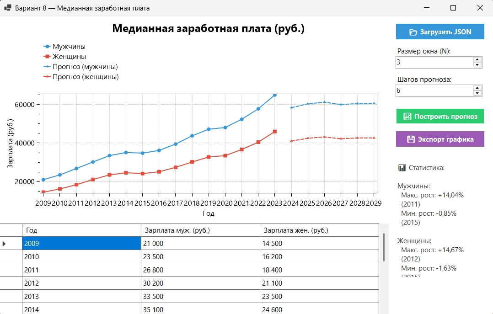
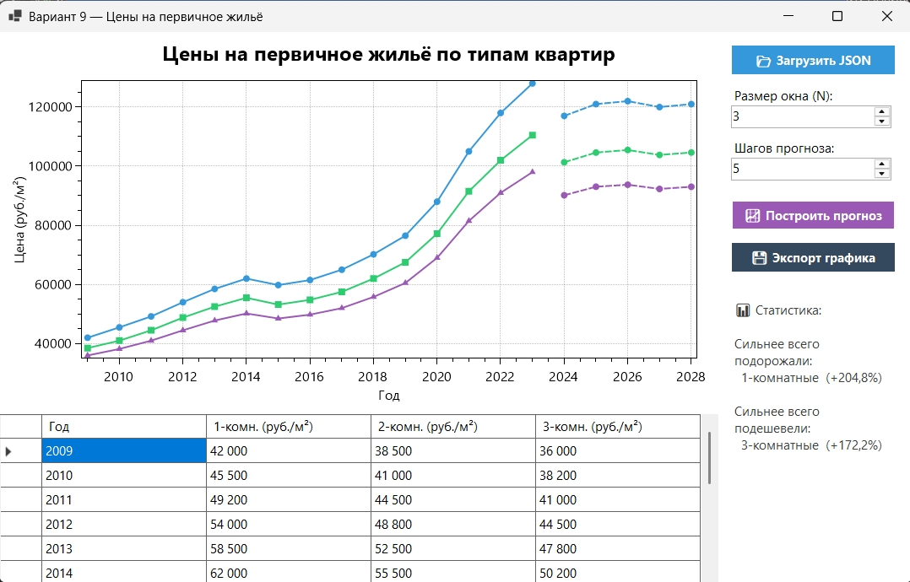
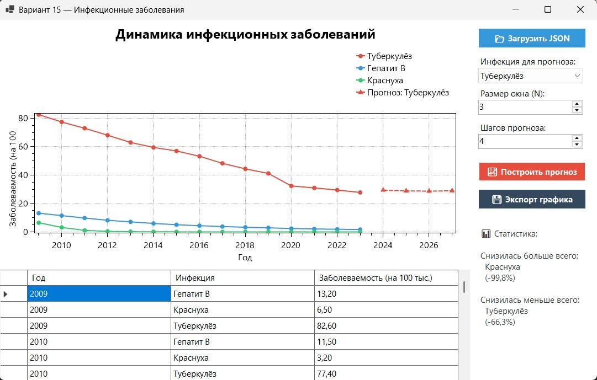

# Статический анализатор 

*Выполнен в рамках лабораторной работы №3 "Системы контроля версий (VCS)"*

---

## Описание проекта
**Статический анализатор** — Windows Forms приложение на C# для статистического анализа данных России с прогнозированием методом скользящей средней.
Проект выполнен командой из 4 участников, каждый реализовал собственный вариант задания.

### Цель
Изучить предназначение и различные способы организаций систем контроля версий (Version Control System, VCS) Git. Познакомиться с операциями над файлами в репозитории и с приемами командной работы над проектом.

### Задание

#### Общее:
У каждого участника команды должен быть свой зарегистрированный аккаунт на выбранной платформе. Один из участников команды создает репозиторий и присоединяет к нему остальных участников. Необходимо придумать общий интерфейс программы (один из участников делает коммит набросков интерфейса в репозиторий, остальные обновляют у себя локальную копию репозитория). Далее каждый из участников обязательно в своей отдельной ветке выполняет свое задание по варианту (задания в команде должны различаться), периодически делая коммиты своих классов и изменений в коде в репозиторий и делая pull request в ветку dev, при этом обновляя (дополняя) свой локальный проект кодом этой ветки (с обновлениями коллег по команде). Ветки после слияния удалять не нужно. Также при pull request каждому необходимо сделать проверку (review) кода коллег – оставить несколько комментариев с советами и замечаниями по различным местам в коде. После того, как все участники команды сделают свое задание, ветка dev сливается в главную ветку master (main), и оформляется файл README.md с пояснениями о выполненных заданиях. 
В итоге должен получиться проект с единым интерфейсом, выполняющий несколько различных задач (по количеству участников команды). У каждого участника команды на компьютере должен находиться полный общий локальный проект (содержащий свое реализованное задание и код коллег по команде). В качестве проверки задания преподаватель также будет смотреть в онлайн репозитории созданные ветки и список коммитов – кто из участников, когда и какие сделал изменения в проекте. 
Проект обязательно должен иметь графический пользовательский интерфейс (User Interface, UI), а также может быть написан на любом языке программирования.

#### По вариантам:
*Кочеев Захар (вариант 8):*
<br>Пользователь открывает файл с данными о медианной заработной плате в России за последние 15 лет. Вывести эту информацию на экран в удобном табличном формате. По этим данным построить графики зависимости от года. Вычислить максимальный и минимальный процент роста (или падения) зарплат у мужчин и у женщин за год. Реализовать статистическое прогнозирование методом экстраполяции по скользящей средней на последующие N лет, вывести эту информацию на отдельном графике либо закрасить другим цветом на том же. 

*Потапова Ксения (вариант 15):*
<br>Пользователь открывает файл с данными об инфекционных заболеваниях в России за последние 15 лет. Вывести эту информацию на экран в удобном табличном формате. По этим данным построить графики зависимости от года. Вычислить заболеваемость какой инфекцией за 15 лет снизилась больше всего, а какой меньше всего. Реализовать статистическое прогнозирование методом экстраполяции по скользящей средней на последующие N лет, вывести эту информацию на отдельном графике либо закрасить другим цветом на том же. 

*Танчук Алина (вариант 5):*
<br>Пользователь открывает файл с данными о численности населения России за последние 15 лет. Вывести эту информацию на экран в удобном табличном формате. По этим данным построить графики зависимости от года. Вычислить максимальный процент прироста и убыли населения за год. Реализовать статистическое прогнозирование методом экстраполяции по скользящей средней на последующие N лет, вывести эту информацию на отдельном графике либо закрасить другим цветом на том же.

*Чулкова Дарья (вариант 9):*
<br>Пользователь открывает файл с данными о ценах на рынке первичного жилья в России за последние 15 лет. Вывести эту информацию на экран в удобном табличном формате. По этим данным построить графики ависимости от года. Вычислить какие n-комнатные квартиры сильнее всего подорожали, а какие подешевели. Реализовать статистическое прогнозирование методом экстраполяции по скользящей средней на последующие N лет, вывести эту информацию на отдельном графике либо закрасить другим цветом на том же. 

## Готовое приложение
Ниже приведены скриншоты уже готового приложения: окно Меню, окна разделов "Численность населения", "Медианная зарплата", "Цены на жильё" и "Инфекционные заболевания":



    

    


---

<br/>

---
## Описание проекта в рамках его разработки

### Функциональность каждого модуля

#### Численность населения (вариант 5)
- Загрузка данных из JSON-файла
- Табличное отображение по годам
- График динамики населения
- Расчёт макс. прироста и убыли (%)
- Прогноз методом скользящей средней на N лет
- Экспорт графика в PNG/PDF

#### Медианная зарплата (вариант 8)
- Раздельный анализ для мужчин и женщин
- Два графика на одной оси (синий/красный)
- Расчёт макс. и мин. % роста зарплат
- Прогноз для обоих рядов
- Экспорт графика в PNG/PDF

#### Вариант 9 — Цены на жильё (вариант 9)
- Три серии: 1-, 2-, 3-комнатные квартиры
- Определение наибольшего подорожания/удешевления
- Прогноз для каждой категории квартир
- Экспорт графика в PNG/PDF

#### Вариант 15 — Инфекционные заболевания
- Несколько болезней в одном файле
- Таблица: строки = годы, столбцы = болезни
- Уникальный цвет для каждой болезни на графике
- Выбор болезни для прогноза через выпадающий список
- Определение наибольшего и наименьшего снижения
- Экспорт графика в PNG/PDF
<br/>

### Архитектура

```
StatAnalyzer/
├── Interfaces/
│   ├── IAnalyzable.cs       # Интерфейс для анализируемых данных
│   └── IDataService.cs      # Интерфейс сервиса данных
├── Models/
│   ├── PopulationRecord.cs  # Вариант 5
│   ├── SalaryRecord.cs      # Вариант 8
│   ├── HousingRecord.cs     # Вариант 9
│   └── DiseaseRecord.cs     # Вариант 15
├── Services/
│   ├── BaseDataService.cs   # Базовый класс (скользящая средняя, загрузка JSON)
│   ├── Variant5DataService.cs
│   ├── Variant8DataService.cs
│   ├── Variant9DataService.cs
│   ├── Variant15DataService.cs
│   └── ExportHalper
├── Forms/
│   ├── MainForm.cs          # Главный интерфейс-навигатор
│   ├── Variant5Form.cs
│   ├── Variant8Form.cs
│   ├── Variant9Form.cs
│   └── Variant15Form.cs
└── Data/
    ├── population.json
    ├── salary.json
    ├── housing.json
    └── diseases.json
```

#### Применённые принципы ООП и SOLID
При создании приложения применялись различные принципы объектно-ориентированного программирования, а также некоторые принципы SOLID:
- *Наследование*: `Variant*DataService` наследуют `BaseDataService<T>`
- *Инкапсуляция*: логика вычислений скрыта в сервисах, формы работают через интерфейсы
- *Полиморфизм*: все модели реализуют `IAnalyzable` (`GetPrimaryValue`, `GetPeriodLabel`)
- *Абстракция*: `IDataService<T>` и `IAnalyzable` определяют контракты
- *SRP (принцип единственной ответственности)*: каждый класс отвечает за одну задачу
- *OCP (принцип открытости/закрытости)*: новый вариант добавляется без изменения существующих классов
- *DIP (принцип инверсии зависимости)*: формы зависят от `IDataService`, а не от конкретных сервисов

<br/>

### Структура веток

Для совместной работы над проектом на онлайн-платформе GitHub были созданы различные ветки, они позволили работать над разными задачами параллельно и отследивать историю изенений (коммитов). Ниже представлена структурная схема созданных веток в рамках этого проекта:

```
main
└── dev
    ├── Alina_Variant_5    # Численность населения
    ├── Zahar_Variant_8    # Медианная зарплата
    ├── Daria_Variant_9    # Цены на жильё
    └── Ksenia_Variant_15   # Инфекционные заболевания
```

<br/>

### Технологии

В проекте были использованы различные технологии (инструменты). Их название и то, для чего они применялись, представлено ниже в таблице.
| Инструмент | Назначение |
|-----------|-----------|
| C# / .NET 6 | Язык и платформа |
| Windows Forms | Графический интерфейс |
| OxyPlot 2.1 | Интерактивные графики с масштабированием и экспортом |
| Newtonsoft.Json | Загрузка данных из JSON |
| Git / GitHub | Система контроля версий |

---
<br/>

## Запуск

Для того чтобы открыть проект у себя на устройстве, необходимо:
1. Установить [.NET 6 SDK](https://dotnet.microsoft.com/download)
2. Клонировать репозиторий
3. Выполнить `dotnet run` из папки `StatAnalyzer/`
4. Загрузить JSON-файл из папки `Data/` в нужный модуль


